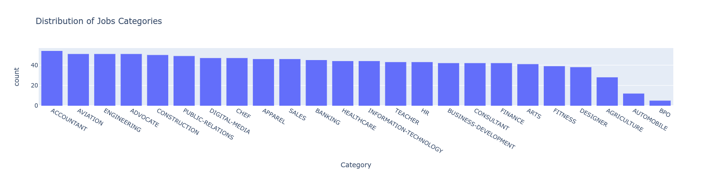
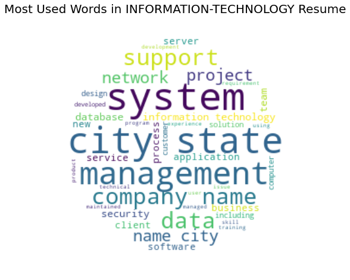
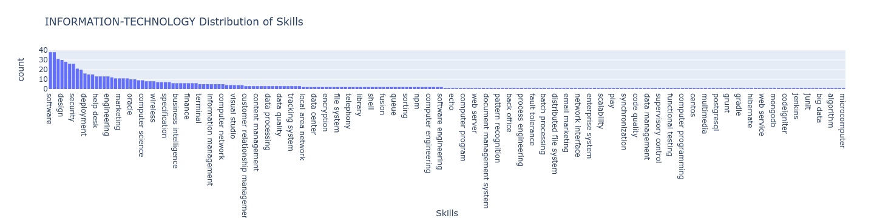

# NLP_work

A collection of Natural Language Processing (NLP) projects built with **spaCy**, **gensim**, **NLTK** and friends. Each project lives in its own folder as a self-contained Jupyter notebook, with pre-rendered HTML/PDF/Markdown exports so you can read the results without running anything.

| Project | What it does | Key techniques | Open |
|---|---|---|---|
| [Topic Modelling of NLP GitHub Repositories](Topic_modelling/) | Pulls popular NLP repositories from the GitHub API and finds the themes in their descriptions | GitHub API, custom spaCy pipeline component, language detection, LDA, word clouds, pyLDAvis | [](https://colab.research.google.com/drive/1AyO14C_SxYo9mg9q53Y-3yGzgHagiCQf) |
| [Resume Analysis with spaCy](Resume_Analysis/) | Pulls skills out of resumes, explores them by job category, and scores a resume against the skills a recruiter asks for | spaCy NER + EntityRuler, NLTK text cleaning, Plotly, displaCy, LDA, pyLDAvis | [](https://mybinder.org/v2/gh/dasdristanta13/NLP_work/HEAD?labpath=Resume_Analysis%2FResume_Analysis_With_Spacy.ipynb) [](https://nbviewer.org/github/dasdristanta13/NLP_work/blob/main/Resume_Analysis/Resume_Analysis_With_Spacy.ipynb) |

---

## Repository structure

```
NLP_work/
├── README.md                     ← you are here
├── renovate.json                 # Renovate bot config (automatic dependency updates)
├── .whitesource                  # WhiteSource/Mend config (dependency vulnerability scanning)
│
├── Topic_modelling/
│   ├── readme.md
│   ├── Topic_Modeling_of_NLP_GitHub_repositories.ipynb   # the notebook
│   └── Topic_Modeling_of_NLP_GitHub_repositories.html    # rendered export with outputs
│
└── Resume_Analysis/
    ├── readme.md
    ├── requirements.txt                                   # setuptools, wheel, spacy, gensim
    ├── Resume_Analysis_With_Spacy.ipynb                   # the notebook
    ├── Resume_Analysis_With_Spacy.html                    # rendered export (interactive charts kept)
    ├── Resume_Analysis_With_Spacy.pdf                     # PDF export
    └── Resume_Analysis_With_Spacy/                        # Markdown export + figures
        ├── Resume_Analysis_With_Spacy.md
        ├── output_19_1.png        # job-category distribution
        ├── output_27_0.png        # skill distribution for the selected category
        └── output_29_1.png        # word cloud of the most used words
```

---

## 1. Topic Modelling of NLP GitHub Repositories

📁 [`Topic_modelling/`](Topic_modelling/) · 📓 [`Topic_Modeling_of_NLP_GitHub_repositories.ipynb`](Topic_modelling/Topic_Modeling_of_NLP_GitHub_repositories.ipynb)

> *"We are using NLP techniques to study NLP tools."*

This notebook asks: **what are popular NLP libraries actually used for?** It answers by modelling the topics in the descriptions of the most-starred NLP repositories on GitHub.

### Pipeline

1. **Collect data (GitHub API via `PyGithub`)**
   It searches for repositories whose README mentions `"NLP"`, written in Python and sorted by stars (descending). The top 99 descriptions are kept.
   ```python
   g = Github(API_KEY)
   pages = g.search_repositories("NLP", sort='stars', order='desc', _in='readme', language='python')
   ```

2. **Pre-process with a custom spaCy pipeline component**
   The model is `en_core_web_sm`, followed by `spacy-fastlang`'s `language_detector` and a custom `@Language.component("clean_text")`. A description is kept only if:
   - it is **≤ 280 characters**,
   - its detected language is **English** with a confidence of **≥ 0.8**,
   - it does **not** contain the word *"list"* (this filters out "Awesome-…" lists).

   Kept descriptions are then **lemmatised**, with **stop words and punctuation removed**.

3. **Topic modelling (gensim LDA)**
   It builds a `corpora.Dictionary`, turns each description into a bag of words, and trains `LdaModel` with `num_topics=3` and `passes=50`.

4. **Visualise**
   - One **word cloud per topic** (`wordcloud` + `matplotlib`).
   - An **interactive inter-topic distance map** made with `pyLDAvis.gensim_models`.

### Results (3 topics)

| Topic | Top terms | Reading |
|---|---|---|
| 0 | model, train, learning, text, pre, PyTorch, framework, deep, Language, BERT | Deep-learning frameworks and pre-trained language models |
| 1 | NLP, library, source, open, text, search, wide, range, application, task | General-purpose, open-source NLP libraries |
| 2 | Twitter, follower, … | Social-media scraping and data-collection tools |

The three topics are well separated on the pyLDAvis map, with no overlap.

### Running it

The notebook was written for **Google Colab** (it uses `#@param` form fields and `!pip` cells).

```bash
pip install pygithub pyLDAvis spacy-fastlang spacy gensim wordcloud pandas matplotlib
python -m spacy download en_core_web_sm
```

You need a **GitHub personal access token**. Put it in the `API_KEY` cell (or, better, read it from an environment variable such as `os.environ["GITHUB_TOKEN"]`) before running the search.

---

## 2. Resume Analysis with spaCy

📁 [`Resume_Analysis/`](Resume_Analysis/) · 📓 [`Resume_Analysis_With_Spacy.ipynb`](Resume_Analysis/Resume_Analysis_With_Spacy.ipynb) · 📄 [PDF](Resume_Analysis/Resume_Analysis_With_Spacy.pdf) · 📝 [Markdown export](Resume_Analysis/Resume_Analysis_With_Spacy/Resume_Analysis_With_Spacy.md)

The goal is to **help recruiters get through hundreds of applications in minutes**. The notebook pulls skills out of resumes with a rule-augmented spaCy NER pipeline, shows skill and vocabulary trends per job category, and gives a **match score** between a resume and the skills a hiring manager asks for.

### Datasets

| File | Description | Source |
|---|---|---|
| `Resume.csv` | 2,400+ resumes from livecareer.com, with columns `ID`, `Resume_str`, `Resume_html`, `Category` (24 job categories) | [Kaggle – Resume Dataset](https://www.kaggle.com/snehaanbhawal/resume-dataset) |
| `jz_skill_patterns.jsonl` | spaCy EntityRuler patterns that label tokens as `SKILL` | A public skill-pattern list (search for `jz_skill_patterns.jsonl`) |

> ⚠️ Neither data file is committed to this repo. Download them and put them next to the notebook before running it.

### Pipeline

1. **Load and sample.** The rows are shuffled and the first **1,000** resumes are kept, so the sample covers every job category while processing stays fast.
2. **Build the NLP pipeline.** The model is `en_core_web_lg`, with an **`entity_ruler`** added from `jz_skill_patterns.jsonl`. The final pipeline is:
   ```
   tok2vec → tagger → parser → attribute_ruler → lemmatizer → ner → entity_ruler
   ```
3. **Clean the text (NLTK).** A regex removes URLs, mentions and special characters. The text is then lower-cased, tokenised, **lemmatised** with `WordNetLemmatizer`, and English **stop words** are removed. The result is stored in `Clean_Resume`.
4. **Extract skills.** `get_skills(text)` collects every entity labelled `SKILL`, and `unique_skills()` removes duplicates. The result is stored in `skills`.
5. **Explore the data.**
   - A Plotly histogram of **job categories**.
   - An `ipywidgets` dropdown to choose a category (or `ALL`), then a histogram of **skills** for that category.
   - A circular-mask **word cloud** of the most used words in that category.
6. **Visualise entities.**
   - `displacy.render(style="ent")` for named entities and skills.
   - `displacy.render(style="dep")` for a dependency parse.
   - **Custom entities.** Every job category is added to the ruler as a `Job-Category` entity, and entity colours are customised (gradients for `SKILL` and `Job-Category`).
7. **Analyse your own resume.** Paste any resume into `input_resume` and render it with the custom entity colours.
8. **Match score.** Give a comma-separated list of required skills, and the notebook reports the share of them found in the resume:
   ```python
   input_skills = "Data Science,Data Analysis,Database,MySQL,Machine Learning,Deep Learning,Analytics,Artificial Intelligence,python,pytorch"
   # → The current Resume is 80.0% matched to your requirements
   ```
9. **Topic modelling.** An LDA model with **4 topics** and 50 passes is trained on the cleaned resumes and explored with pyLDAvis. Its topics roughly map to *project/management/system*, *company/business*, *customer/services* and *state/city/student*.

### Sample outputs

| Job-category distribution | Most used words (Information Technology) |
|---|---|
|  |  |



### Running it

```bash
cd Resume_Analysis
pip install -r requirements.txt
pip install nltk pandas numpy jsonlines plotly matplotlib wordcloud pyLDAvis ipywidgets
python -m spacy download en_core_web_lg
jupyter notebook Resume_Analysis_With_Spacy.ipynb
```

The NLTK `stopwords` and `wordnet` corpora are downloaded automatically by the notebook. The notebook was developed on Python 3.9.

---

## Tech stack

| Area | Libraries |
|---|---|
| Core NLP | spaCy (`en_core_web_sm`, `en_core_web_lg`, EntityRuler, displaCy), NLTK, spacy-fastlang |
| Topic modelling | gensim (`LdaModel`), pyLDAvis |
| Data | pandas, NumPy, jsonlines, PyGithub |
| Visualisation | Plotly Express, Matplotlib, WordCloud, ipywidgets |

## Repository maintenance

- **Renovate** (`renovate.json`, `config:base`) opens PRs automatically to keep dependencies up to date.
- **WhiteSource / Mend Bolt** (`.whitesource`) scans dependencies for known vulnerabilities and fails the check run when it finds one.

## Roadmap

More NLP projects will be added to this repository over time. Ideas and PRs are welcome.

## Author

**Dristanta Das** · [GitHub @dasdristanta13](https://github.com/dasdristanta13)
